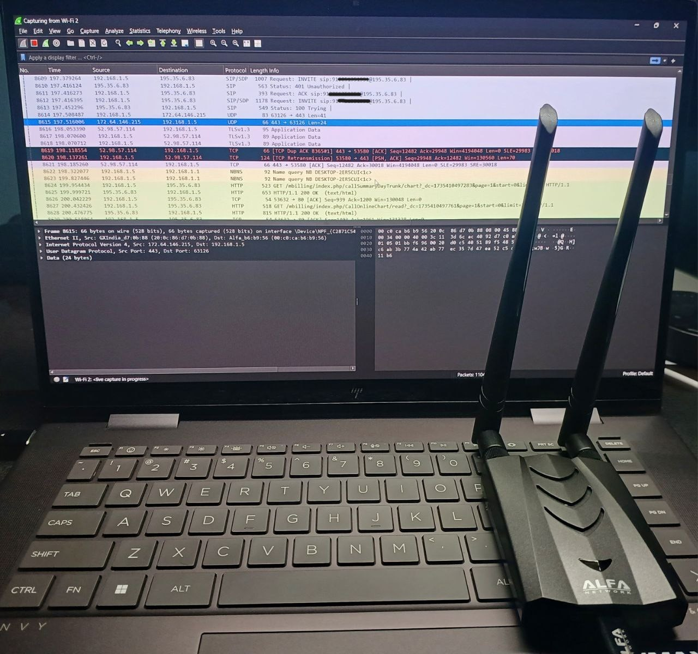
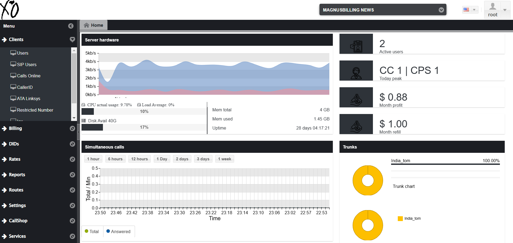
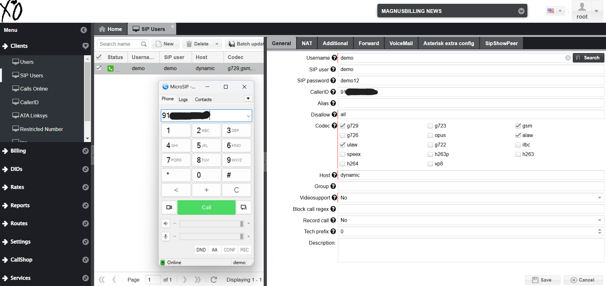
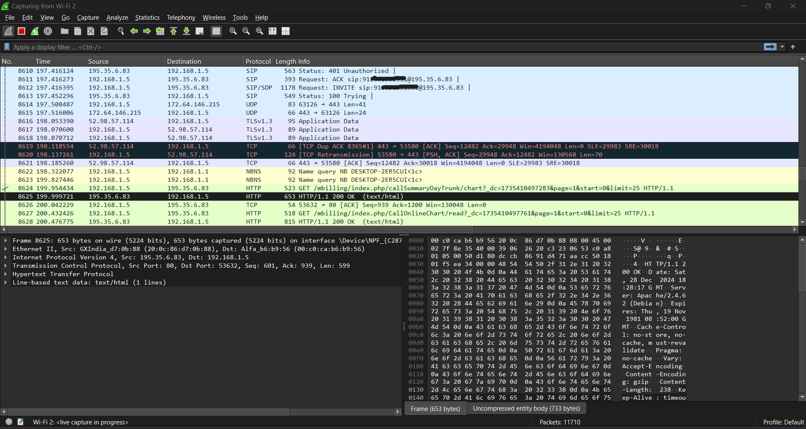
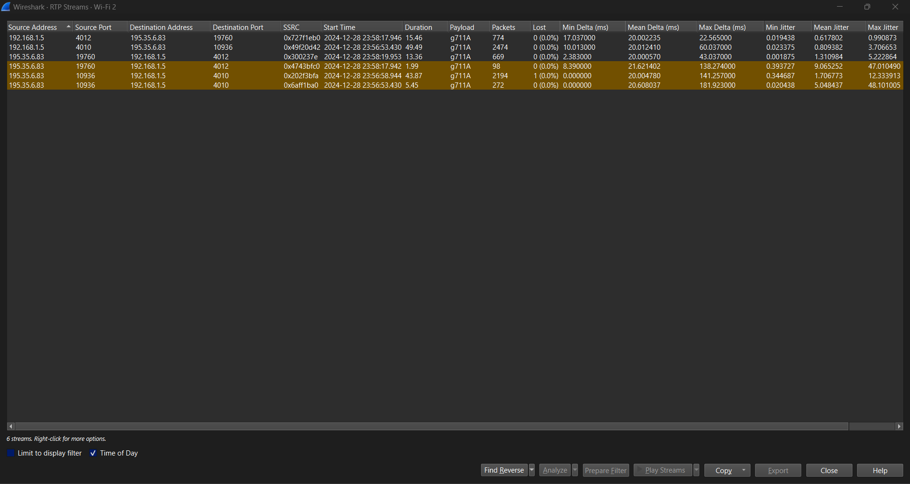
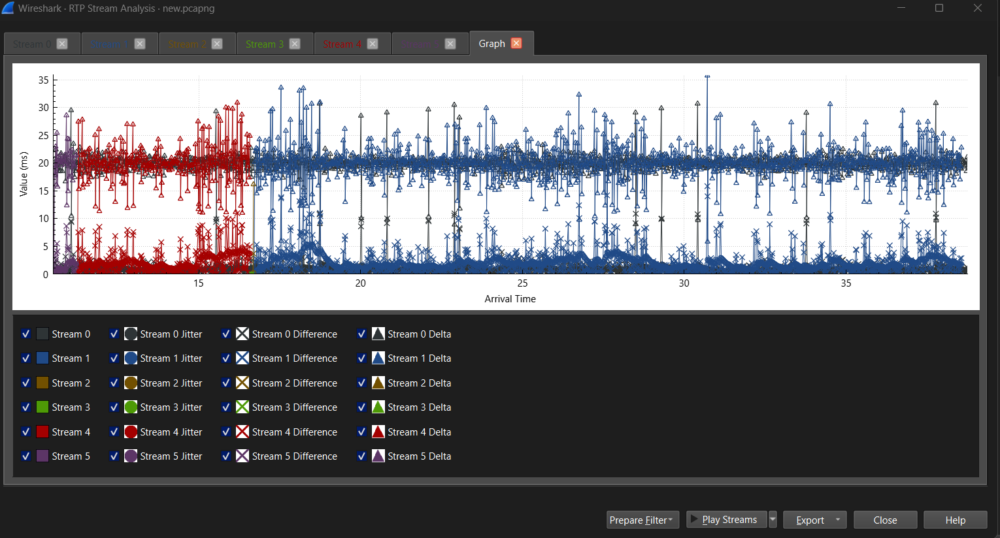
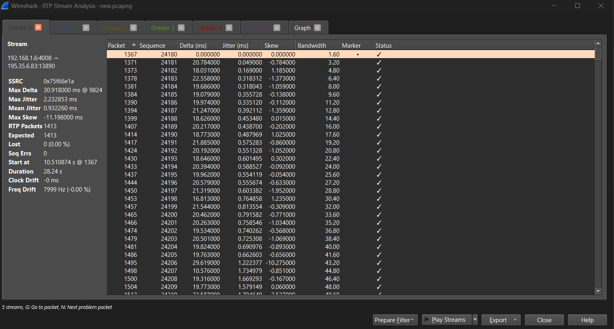
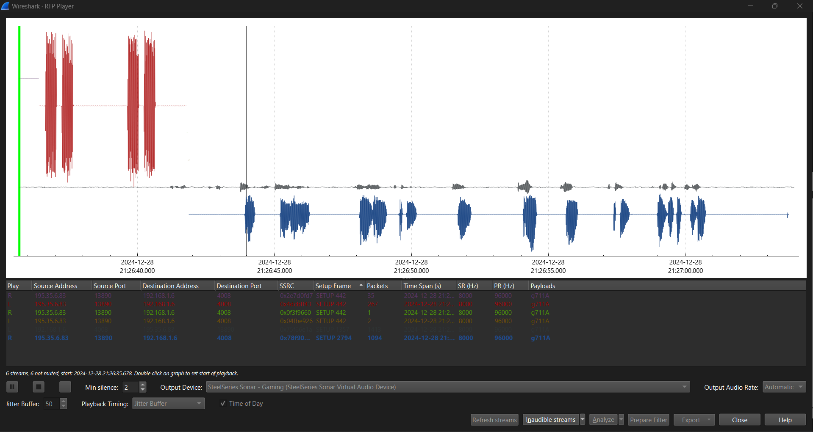
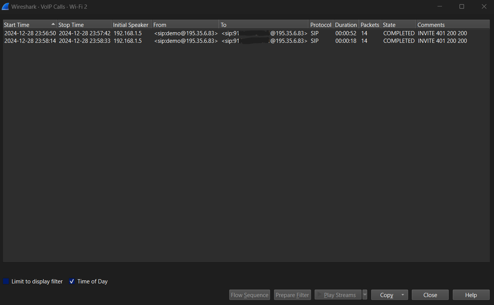

# VoIP Traffic Interception & Call Reconstruction

Real-time capture, decryption, and reconstruction of VoIP (Voice over IP) calls from wireless network traffic using Wireshark, an Alfa AWUS036ACH Wi-Fi adapter, and a custom VoIP spoofing server (MagnusBilling/Asterisk).

> **Disclaimer:** This project was conducted in a controlled lab environment for educational and authorized security research purposes only. Unauthorized interception of communications is illegal.

---

## Table of Contents

- [Overview](#overview)
- [Architecture](#architecture)
- [Hardware & Software](#hardware--software)
- [Technical Methodology](#technical-methodology)
- [Captured Evidence](#captured-evidence)
- [Packet Captures](#packet-captures)
- [Key Findings](#key-findings)
- [References](#references)

---

## Overview

This project demonstrates the end-to-end process of intercepting VoIP communications over a wireless network by:

1. Deploying a custom VoIP call spoofing server to generate controlled SIP/RTP traffic
2. Capturing raw 802.11 frames in monitor mode using an external Wi-Fi adapter
3. Decrypting WPA2-PSK encrypted wireless traffic
4. Isolating SIP signaling and RTP media streams from the captured traffic
5. Reconstructing and playing back the intercepted voice calls

The attack surface leverages the lack of end-to-end encryption in SIP/RTP protocols, demonstrating that WPA2 network-layer encryption alone is insufficient to protect VoIP communications from a passive attacker with the PSK.

## Captured Evidence

### 1. Capture Environment Setup
Physical setup showing Wireshark live capture with the Alfa AWUS036ACH adapter connected, capturing SIP/RTP traffic in real-time.



### 2. VoIP Server Dashboard (MagnusBilling)
Server monitoring dashboard showing active users, concurrent calls (CC 1 | CPS 1), trunk utilization, and server resource metrics.



### 3. SIP User Configuration
MagnusBilling SIP user configuration panel showing the `demo` account with MicroSIP softphone registered as a client. Codec configuration: G.729, G.711A (alaw/ulaw), GSM.



### 4. Wireshark Live Packet Capture
Live capture on the Wi-Fi 2 interface showing mixed traffic: SIP signaling (INVITE, 401, ACK, 100 Trying), HTTP, TCP, TLS, NBNS, and UDP packets between the VoIP server and client.



### 5. RTP Streams Detected
Wireshark RTP Streams window displaying 6 detected streams between `192.168.1.5` and `195.35.6.83` with G.711A codec, showing packet counts, jitter metrics, and delta timing analysis.



### 6. RTP Stream Analysis - Jitter/Delta Graph
Graphical analysis of all 6 RTP streams plotting jitter, delta, difference, and skew values over arrival time. Consistent ~20ms delta confirms stable G.711A transmission.



### 7. RTP Stream Analysis - Packet-Level Detail
Per-packet analysis of Stream 0 (`192.168.1.6:4008 -> 195.35.6.83:13890`) showing sequence numbers, delta timing, jitter, skew, and bandwidth. SSRC: `0x75f66e1a`, 1413 packets, 0 lost, duration: 28.24s.



### 8. RTP Player - Audio Waveform Playback
Wireshark RTP Player showing decoded audio waveforms for the intercepted call streams. Both sides of the conversation are visible as separate waveforms, ready for full-duplex playback.



### 9. Reconstructed VoIP Calls
Wireshark VoIP Calls view showing 2 completed SIP calls from `<sip:demo@195.35.6.83>` with durations of 52s and 18s, both in `COMPLETED` state.



## Architecture

```
                                              [Attacker Machine]
                                              Wireshark + Npcap
                                              Alfa AWUS036ACH
                                              (Monitor Mode)
                                                    |
                                                    | 802.11 Frame Capture
                                                    | (WPA2-PSK Decryption)
                                                    |
[VoIP Server]  <-------- SIP/RTP -------->  [VoIP Client]
MagnusBilling                                MicroSIP Softphone
Asterisk PBX                                 SIP User: demo
192.168.1.5                                  Codec: G.711A (alaw/ulaw)
Port: 5060 (SIP)                             Port: Dynamic (RTP)
      4010-4012 (RTP)
```

## Hardware & Software

### Hardware
| Component | Specification |
|-----------|--------------|
| Wi-Fi Adapter | Alfa AWUS036ACH (Realtek RTL8812AU chipset) |
| Mode | Monitor mode with packet injection capability |
| Antenna | Dual 5dBi omnidirectional |

### Software
| Tool | Purpose |
|------|---------|
| **Wireshark** | Packet capture, protocol analysis, RTP stream reconstruction |
| **Npcap** | Packet capture driver (replaces WinPcap) |
| **RTL8812AU Drivers** | Realtek drivers for Alfa adapter monitor mode support |
| **MagnusBilling** | VoIP billing/PBX platform (Asterisk-based) used as the call server |
| **MicroSIP** | Lightweight SIP softphone client for generating test calls |

### Protocols Analyzed
| Protocol | Role | RFC |
|----------|------|-----|
| **SIP** (Session Initiation Protocol) | Call signaling (INVITE, ACK, BYE) | RFC 3261 |
| **SDP** (Session Description Protocol) | Media negotiation (codec, ports) | RFC 4566 |
| **RTP** (Real-time Transport Protocol) | Voice data transport | RFC 3550 |

## Technical Methodology

### Phase 1: Environment Setup

**VoIP Server Configuration (MagnusBilling/Asterisk)**
- Deployed MagnusBilling PBX on a controlled server (`192.168.1.5`)
- Created SIP user account (`demo`) with codecs: G.729, G.711A (alaw), G.711U (ulaw), GSM
- Configured SIP trunk routing for outbound calls
- Registered MicroSIP softphone as the SIP client

**Capture Station Configuration**
- Installed Realtek RTL8812AU drivers to enable monitor mode on the Alfa AWUS036ACH
- Installed Npcap for high-performance raw packet capture
- Configured Wireshark to capture on the `Wi-Fi 2` interface (Alfa adapter)

### Phase 2: Wireless Traffic Capture

```
Standard NIC:     Only captures traffic TO/FROM the host machine
Alfa (Monitor):   Captures ALL 802.11 frames on the channel (promiscuous + monitor)
```

- Enabled monitor mode on the Alfa adapter to passively capture all wireless frames on the target channel
- Imported the WPA2-PSK key into Wireshark for real-time decryption of 802.11 encrypted frames
- Initiated live capture while VoIP calls were in progress between the server and client

### Phase 3: Protocol Analysis

**SIP Signaling Analysis**
- Filtered captured traffic for SIP packets (`sip` display filter)
- Traced the complete call lifecycle:
  - `INVITE` - Call initiation with SDP offer
  - `401 Unauthorized` - Digest authentication challenge
  - `ACK` - Call establishment acknowledgment
  - `200 OK` - Successful response
  - `BYE` - Call termination
- Extracted call metadata: source/destination URIs, IP addresses, ports, codec negotiation

**RTP Media Stream Analysis**
- Navigated to `Telephony > RTP > RTP Streams` to enumerate all active RTP streams
- Identified 6 RTP streams across 2 completed VoIP calls
- Stream characteristics:
  - Codec: G.711A (PCMA) at 8000 Hz sample rate
  - Payload rate: 96000 Hz
  - Mean inter-packet delta: ~20 ms
  - Packet loss: 0.0% (controlled environment)
  - Mean jitter: < 1 ms

### Phase 4: Call Reconstruction & Playback

- Used `Telephony > RTP > RTP Player` to decode and play back the captured voice streams
- Synchronized bidirectional RTP streams (caller + callee) for full-duplex playback
- Verified call reconstruction via `Telephony > VoIP Calls` which displayed:
  - 2 completed SIP calls
  - Call durations: 00:00:52 and 00:00:18
  - State: `COMPLETED` with SIP flow: `INVITE 401 200 200`
## Packet Captures

Raw packet captures are included in the `captures/` directory for independent analysis:

| File | Size | Description |
|------|------|-------------|
| `voip-capture-01.pcapng` | 6.3 MB | Primary capture containing SIP signaling + RTP streams |
| `voip-capture-02.pcapng` | 3.3 MB | Secondary capture with additional call sessions |

**To analyze:**
```
wireshark captures/voip-capture-01.pcapng
```

Then navigate to `Telephony > VoIP Calls` or `Telephony > RTP > RTP Streams`.

## Key Findings

1. **WPA2-PSK does not protect VoIP calls from passive interception** - An attacker with the network PSK can decrypt all wireless frames and reconstruct voice calls in cleartext
2. **SIP/RTP lack native encryption** - Without SRTP (Secure RTP) or TLS-wrapped SIP (SIPS), all signaling and media are transmitted in plaintext after wireless decryption
3. **G.711 codec streams are trivially reconstructable** - Wireshark natively supports decoding and playback of G.711A/U streams with zero additional tooling
4. **Call metadata exposure** - Even without reconstructing audio, SIP headers expose caller/callee identities, call duration, codec negotiation, and network topology

### Recommended Mitigations
- Enforce **SRTP** (RFC 3711) for RTP media encryption
- Use **SIPS** (SIP over TLS) for signaling encryption
- Deploy **SRTP-TLS** end-to-end on the PBX
- Implement **WPA3-SAE** to mitigate PSK-based decryption
- Use **VPN tunnels** for VoIP traffic over untrusted networks

## References

- [RFC 3261 - SIP: Session Initiation Protocol](https://datatracker.ietf.org/doc/html/rfc3261)
- [RFC 3550 - RTP: Real-time Transport Protocol](https://datatracker.ietf.org/doc/html/rfc3550)
- [RFC 4566 - SDP: Session Description Protocol](https://datatracker.ietf.org/doc/html/rfc4566)
- [RFC 3711 - SRTP: Secure Real-time Transport Protocol](https://datatracker.ietf.org/doc/html/rfc3711)
- [Wireshark VoIP Analysis Documentation](https://wiki.wireshark.org/VoIP_calls)
- [Alfa AWUS036ACH Specifications](https://www.alfa.com.tw/products/awus036ach)

---

## License

This project is licensed under the MIT License - see the [LICENSE](LICENSE) file for details.
